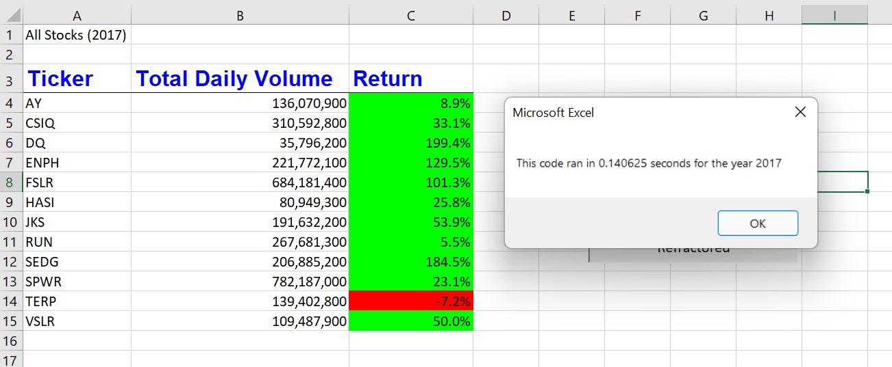
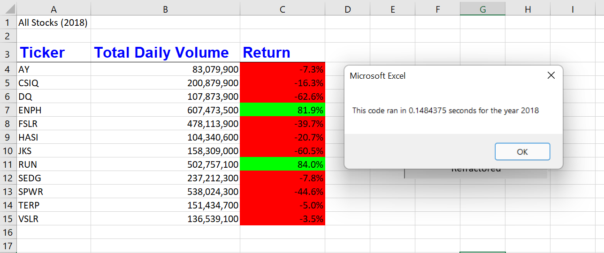
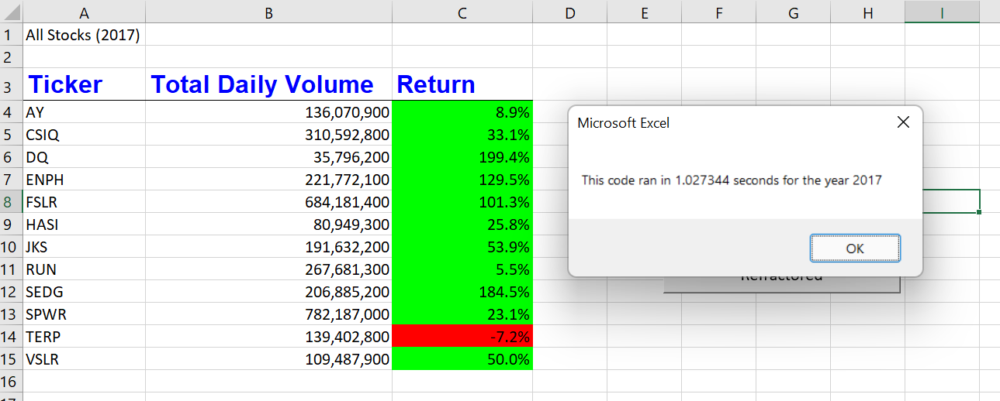

# Stock-Analysis with VBA

## Overview of Project
Using VBA, we are researching trends of certain stocks from previous years in order to give our client better judgement on which to invest in.

### Purpose
Looking into the years 2017 and 2018 regarding 12 different stocks, we will see if they had either a positive net return for that year, or a negative one. In order to do this, we created code in VBA to determine what the starting price and the ending price for each stock that year. Then, using those two values, we will see if the return resulted in a positive or negative net return for the year.

## Results
As we can see from the following image:

11 out of the 12 Stocks had a positive net result. However, we can see from this image:

that only 2 of those had a positive net return in 2018. Using this, we can tell our client that our top two choices to invest in would be ENPH and RUN. Between the two of these, ENPH would probably be the safer bet of the two, as it generally has a steady return rate for both years, as RUN only just made it into the positive in 2017.

### Changes because of Refractor
The two images above were used after we refractored our code. By refractoring, we made the process time even fastor. With our original code, the following times were:

as well as:

